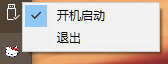

# 自用AHK辅助
> 原神9-剧情根本不想看，每天做委托还有疯狂点键鼠快进对话,浪费我的键鼠寿命，而且很累，因此，因AHK进行辅助
## 脚本功能
> 现在只适用与1920*1080分辨率
- [x] **长按f变为连续短按f并且鼠标不断点击最后一个对话选项**
- [x] **f4连续跳过剧情**（不用长按f，检测出现右上角界面会停止）
- [x] ctrl+9强化圣遗物（使用四星）跳过动画
- [x] **ctrl+7重启，用于强制暂停已经执行的命令**
- [x] **可设置开机无感启动**
- [x] **新增那维莱特转圈圈（鼠标右键）**
## 下载地址
[Genshin_ahk.exe (885KB)](https://github.com/799034552/my_ahk/releases/download/v1.0/Genshin_ahk.exe)
## 脚本内容详情
1、按下F直接输入F，如果按下时间超过400毫秒，就判断为长按，在[150,300]ms的随机间隔中短按f，在[150,300]ms的随机间隔中点击对话框。
2、是否开机启动在右下角托盘处

### 转圈圈

那维莱特转圈圈，按下鼠标右键自动长按重攻并且转圈圈

