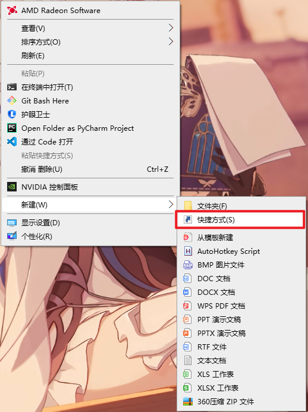

# 自用AHK辅助
> 原神9-剧情根本不想看，每天做委托还有疯狂点键鼠快进对话,浪费我的键鼠寿命，而且很累，因此，因AHK进行辅助
## 脚本功能
> 现在只适用与1920*1080分辨率
* 长按f变为连续短按f并且鼠标不断点击最后一个对话选项
* 可设置开机无感启动
## 下载地址
## 脚本内容详情
按下F直接输入F，如果按下时间超过400毫秒，就判断为长按，在[150,300]ms的随机间隔中短按f，在[150,300]ms的随机间隔中点击对话框

## 开发坑（使用者不用看）
### 获取管理员权限
主体功能反而很简单，看一下新手入门就差不多会了，难搞的开机启动和管理员权限，在原神里控制是需要管理员权限的，但是管理员权限需要弹窗确认，在开机启动的时候就会弹窗，这样会很烦，所以必须使用无感知的管理员权限获取手段

**使用任务计划程序绕过管理员权限提示**

* 自动方式

14年就有人知道这个方法了[RunAsTask()](https://www.autohotkey.com/boards/viewtopic.php?t=4334)，使用一个函数就能将ahk脚本加入计划程序，对于.ahk文件会自动弹出需要管理员权限，但是对于使用ahk2exe转换后的exe文件，直接使用这个函数不行，**需要在第一次运行的时候用管理员权限打开一次**，后面才能正常使用，并且在程序更换位置之后要重新添加计划程序，不可能要求用户第一次运行时手动进行管理员权限的获取，因此十分蛋疼。

而ahk自带的获取管理员权限会在每次运行时都提示，无法做到开机无感知启动，因此把两者结合：**先往用户程序空间中记录一个txt文件保存当前程序路径，如果该文件不存在或者运行路径不等于保存的，那么就用显式的提示先获取权限，然后更新txt并写入计划程序，之后都不会提示需要管理员权限了**。

* 手动方法

1、win+R，然后输入`taskschd.msc`，打开任务计划程序

2、创建任务

3、随便写名称，勾上使用最高权限运行

4、新建操作

5、选择exe文件

6、可以看到有该任务了

7、在随便一个地方创建快捷方式

8、快捷方式指向该任务，直接输入下面的命令，test是任务名称

`schtasks /run /tn “test”`

9、更换图标

**此时打开快捷方式就不会有权限控制提示了**

### ahk自循环

使用$命令，比如`$F::`就只会捕获显式的键盘按下的命令，不会捕获ahk自己发送的

